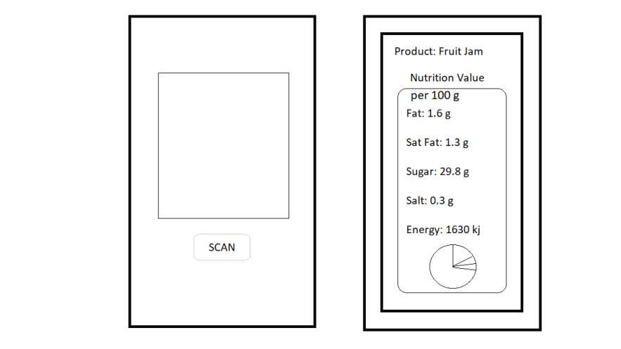

# Project_Wiki
# Goal: 

Our project focuses on providing senior citizens or low vision individuals with a simpler way to keep track of calories or macronutrients daily. Instead of manual entry the nutrition value for a grocery item daily, computer vision offers solutions to quickly identify a grocery item and input nutrition information into a calorie tracking mobile application. This way it can help senior citizens who have chronic diabetes or hypertension to monitor their diet and help visually impaired individuals who have risk factors, such as diabetes and hypertension, to keep track of their diet .

###### Section 1.1 INPUT
Part of the constraints for this project is to have good lighting, clear and readable labels, good contrast, directly facing the camera, and only in English.

###### Section 1.2 OUTPUT
The output will be a larger font indicating the grocery item and nutritional value.

## Section 2: 
Minimum API 19, Android 4.4.2, using OpenCV version 2.4.10 in AndroidStudio and will test on Samsung Galaxy

## Section 3:

###### Section 3.1: Overview: 
We have the following system components: 
  - Scanning the label and reading the label.
  - Web crawling to find related nutrition labels.
  - Display the output in nutritional value. 

###### Section 3.2: Scanning the label and reading the label:
  - The user need to use camera to scan the packaged grocery item (product name needs to be visible without obstruction). 
  - We will use a Gaussian smoothing filter on the label image taken by the user  and transform it to black text and white background for maximum contrast.  https://ieeexplore-ieee-org.proxylib.csueastbay.edu/document/7440492 
  Optional and can delete: 
  - Option 1: using Res-CNN to segment text boxes to identify important text boxes that contain grocery label name in the image. 
  - Option 2: cv2.RETR_LIST to find contour of the text box for segmentation
  - Use Optical Character recognition algorithm to extract text from the grocery label image provided by the user( https://ieeexplore.ieee.org/document/9087314). If the algorithm  can not recognize the text, will prompt user to retake pictures. 
  - The text extracted from the Optical Character recognition algorithm will then be saved and used for text recognition during web crawling. Through web crawling, we can extract more matching grocery package images and nutrition labels that will match the grocery item the user provided. This step will be explained in the next section during web crawling. 

###### Section 3.3 Web Crawling:
  - Once the grocery item is identified, we can use web crawling to extract nutritional value of the product.
  - We will use BeautifulSoup library from python to do web crawling.
  - Once the html is extracted using crawling, we parse the obtained data to extract the needed information

Optional Section: CNN
- Use cnn to find healthier alternatives grocery item and display right next to the grocery item user enter. 

###### Section 3.4 Reporting Results: 
- We will present the user both a magnified grocery label name and macronutrients values of the grocery item. 

## Section 4 GUI Interface: 

2 interfaces:
- Initial interface that provides a button to start the application and capture image.
- The result interface that will show text label name and macronutrient information. 

